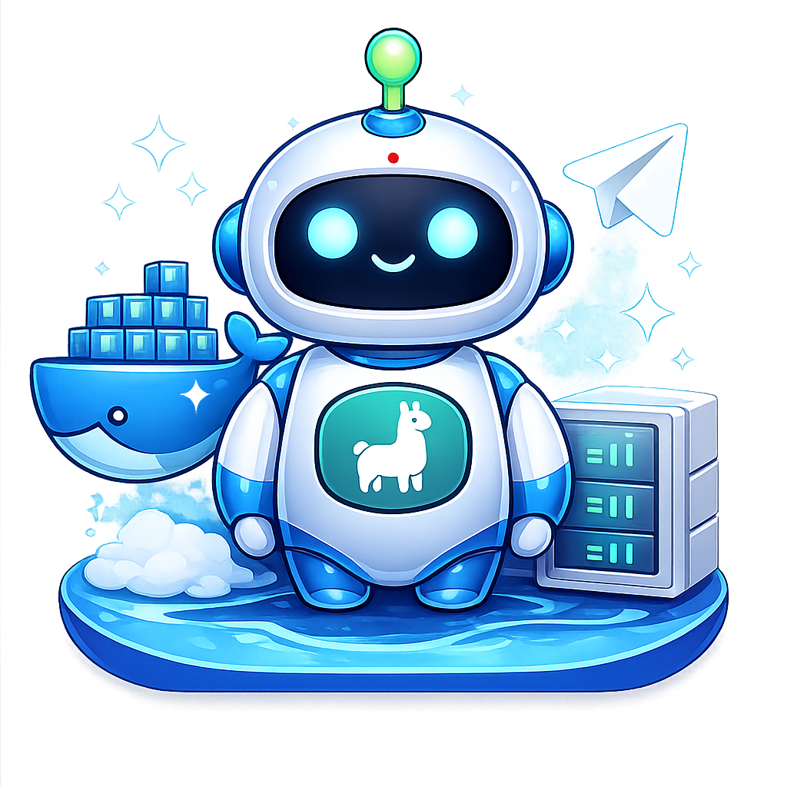

# Ollama Telegram Bot

[](https://github.com/ArtCC/ollama-telegram-bot/actions/workflows/docker-publish.yml)
[](LICENSE)
[](https://www.python.org/)
[](docker-compose.yml)
[](https://ghcr.io/artcc/ollama-telegram-bot)

<p align="left">
  
</p>

Open-source Telegram bot to chat with Ollama models running on your server.

## Overview

- Telegram bot with async handlers and user-friendly error responses.
- Ollama integration with timeout, retries, and categorized failures.
- Docker-first deployment with environment-driven configuration.
- CI workflow for publishing container images to GHCR.

## Project Structure

```text
ollama-telegram-bot/
├── .github/
│   └── workflows/
│       └── docker-publish.yml
├── src/
│   ├── app.py
│   ├── bot/
│   │   ├── handlers.py
│   │   └── error_handler.py
│   ├── config/
│   │   └── settings.py
│   ├── core/
│   │   └── context_store.py
│   ├── services/
│   │   └── ollama_client.py
│   └── utils/
│       ├── logging.py
│       └── telegram.py
├── tests/
│   ├── test_context_store.py
│   └── test_telegram_utils.py
├── docker-compose.yml
├── Dockerfile
├── .env.example
├── CHANGELOG.md
├── CONTRIBUTING.md
└── pyproject.toml
```

## Phase 1 (MVP)

Use this checklist to track Phase 1 progress.

- [x] Bot foundation and strict environment-based configuration.
- [x] Core commands: `/start`, `/help`, `/clear`.
- [x] Ollama integration with timeout, retry, and user-facing error handling.
- [x] Basic per-user in-memory conversation context.
- [x] `/models` command for model listing and selection.
- [x] Persist selected model per user in SQLite.
- [x] `/currentmodel` command to display active model.
- [ ] User whitelist and basic rate limiting.
- [ ] Logging improvements and healthcheck endpoint/command.

## Telegram API Choices (MVP)

- Long polling (`run_polling`) for simpler deployment.
- Command registration with `set_my_commands`.
- `sendChatAction(typing)` before calling Ollama.
- Global error handler via `Application.add_error_handler`.
- Message splitting for Telegram's 4096-char limit.
- `drop_pending_updates=True` on startup to avoid stale backlog.
- `/models` lists available models and allows selection via `/models <name>`.
- `/currentmodel` shows the active model for the current user.

## Configuration

The stack configuration file is `docker-compose.yml`.

```yaml
services:
  bot:
    image: ${BOT_IMAGE}
    container_name: ${BOT_CONTAINER_NAME:-ollama-telegram-bot}
    restart: unless-stopped
    env_file:
      - .env
    environment:
      TELEGRAM_BOT_TOKEN: ${TELEGRAM_BOT_TOKEN}
      OLLAMA_BASE_URL: ${OLLAMA_BASE_URL}
      OLLAMA_DEFAULT_MODEL: ${OLLAMA_DEFAULT_MODEL}
      MODEL_PREFS_DB_PATH: ${MODEL_PREFS_DB_PATH:-/data/bot.db}
      ALLOWED_USER_IDS: ${ALLOWED_USER_IDS}
      LOG_LEVEL: ${LOG_LEVEL:-INFO}
      REQUEST_TIMEOUT_SECONDS: ${REQUEST_TIMEOUT_SECONDS:-60}
      MAX_CONTEXT_MESSAGES: ${MAX_CONTEXT_MESSAGES:-12}
      TZ: ${TZ:-Europe/Madrid}
```

See `.env.example` for the complete list and example values.

- `TELEGRAM_BOT_TOKEN`
- `OLLAMA_BASE_URL`
- `OLLAMA_DEFAULT_MODEL`
- `MODEL_PREFS_DB_PATH`
- `BOT_DATA_DIR`
- `REQUEST_TIMEOUT_SECONDS`
- `MAX_CONTEXT_MESSAGES`
- `LOG_LEVEL`

## Docker Compose (Fully Variable-Driven)

Deployment is designed to use:

- `.env` locally.
- Environment variables in Portainer (Stack > Environment variables).

### 1) Configure variables

```bash
cp .env.example .env
```

Edit `.env` with your values.

### 2) Start the stack

```bash
docker compose pull
docker compose up -d
```

## Local Development

```bash
python -m venv .venv
source .venv/bin/activate
pip install -e .[dev]
python -m src.app
```

## Lint, Type Check, Tests

```bash
ruff check .
ruff format .
mypy src
pytest -q
```

## GHCR Publish

The workflow in `.github/workflows/docker-publish.yml` publishes:

- `ghcr.io/artcc/ollama-telegram-bot:latest` (main branch)
- `ghcr.io/artcc/ollama-telegram-bot:sha-<commit>`
- `ghcr.io/artcc/ollama-telegram-bot:vX.Y.Z` (tags)

For private image pulls on server/Portainer:

```bash
echo "$GITHUB_TOKEN" | docker login ghcr.io -u YOUR_GITHUB_USER --password-stdin
```

The token must include at least `read:packages` permission.

## Documents

- [CHANGELOG.md](CHANGELOG.md)
- [CONTRIBUTING.md](CONTRIBUTING.md)

## 🎨 Bot Avatar

You can use the official bot avatar for your own instance:

<p align="left">
  
</p>

To set this image as your bot's profile picture:
1. Right-click the image above and save it
2. Open [@BotFather](https://t.me/botfather) on Telegram
3. Send `/setuserpic`
4. Select your bot
5. Upload the downloaded image

## License

This project is licensed under the Apache License 2.0. See [LICENSE](LICENSE).

## Author

Arturo Carretero Calvo ([ArtCC](https://github.com/ArtCC))