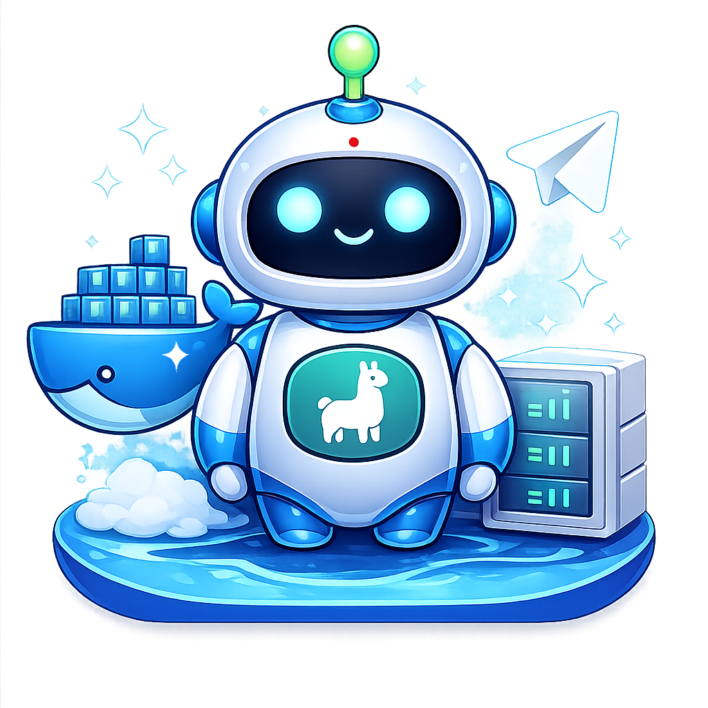

# Ollama Telegram Bot

[](https://github.com/ArtCC/ollama-telegram-bot/actions/workflows/docker-publish.yml)
[](LICENSE)
[](https://www.python.org/)
[](docker-compose.yml)
[](https://ghcr.io/artcc/ollama-telegram-bot)

<p align="left">
  
</p>

Open-source Telegram bot to chat with local Ollama models and Ollama Cloud from your server.

## Overview

- Full conversational chat backed by local Ollama models via `/api/chat` (with `/api/generate` fallback).
- **Streaming responses**: model output appears in real time — a placeholder is sent instantly and updated every ~1 second until the answer is complete.
- Text, image, and document (TXT / MD / CSV / JSON / YAML / PDF / DOCX / XLSX) input modes; voice/audio intentionally disabled.
- File memory: uploaded files are persisted per user and can be injected as RAG context for any future message.
- Web catalog browser (`/webmodels`): browse, search, and download models from `ollama.com/search` with real-time progress and cancel.
- Local model manager: list, filter, switch, inspect, and delete installed models.
- Live web search (`/websearch`): grounded answers synthesised by your local model from real-time web results via Ollama Cloud API.
- Automatic model orchestrator: switches to the best local model for vision, code, or general tasks without user action.
- Per-user access control, rate limiting, SQLite-backed preferences and conversation context.
- Full localization (en / es / de / fr / it) with automatic Telegram language detection.
- Docker-first deployment with fully variable-driven Compose and CI publish workflow to GHCR.

## Commands

| Command | Description |
|---|---|
| `/start` | Welcome message. |
| `/help` | Show available commands. |
| `/health` | Check Ollama and bot status. |
| `/clear` | Clear conversation history for the current session. |
| `/models [query]` | Browse and switch between installed local models. Accepts an optional filter query. |
| `/webmodels [query]` | Browse and download models from the Ollama web catalog. Use the inline 🔍 Search button to filter interactively. |
| `/currentmodel` | Show the model currently selected for your session. |
| `/deletemodel <name>` | Delete a locally installed model after confirmation. |
| `/info [model]` | Show model metadata card (family, parameters, quantization, architecture, size). Defaults to the current model. |
| `/files` | Manage saved files: select/deselect for context, preview images, delete, or ask directly with `💬 Ask`. |
| `/askfile <id> <question>` | Ask a question scoped to a single saved file. |
| `/websearch <query>` | Search the live web; your local model synthesises an answer from the results. Requires `OLLAMA_API_KEY`. |
| `/cancel` | Exit any pending interaction mode (search input, ask mode, etc.). |

## User Interface

### Persistent Keyboard

A compact 2×2 keyboard is always visible at the bottom of the chat:

| | |
|---|---|
| 🧠 Models | 📁 Files |
| 🔎 Web Search | ❓ Help |

These buttons trigger the same actions as their slash-command equivalents (`/models`, `/files`, `/websearch`, `/help`). The keyboard reappears automatically after every bot action.

Other commands (`/webmodels`, `/currentmodel`, `/clear`, `/deletemodel`, `/info`, `/askfile`, `/cancel`, `/health`) are available only via slash commands — see the Commands table above.

### Inline Buttons

Contextual inline buttons appear inside specific flows:

- **Model lists** — pagination (⬅️ / ➡️), refresh (🔄), close (✖️).
- **File management** — toggle selection (✅/☑️), delete (🗑 with Confirm/Cancel), ask (💬), preview (🖼️), add (📤).
- **Web model catalog** — download (⬇️), size picker, open web page (🌐), cancel download (⏹).
- **Destructive actions** — `/clear`, `/deletemodel`, and file deletion always show a Confirm / Cancel pair.

### Status Icons

All bot messages follow a consistent icon convention:

| Icon | Meaning |
|---|---|
| ℹ️ | Informational |
| ✅ | Success |
| ⚠️ | Warning |
| ❌ | Error |
| ⏳ | Processing / streaming in progress |

### Streaming Responses

Model answers are streamed in real time:

1. The bot sends a placeholder message (⏳) immediately.
2. Text is accumulated and the message is edited every ~1 second.
3. Intermediate edits use plain text; the final edit applies HTML formatting.
4. If the response exceeds Telegram's 4 096-character limit, remaining text is sent as follow-up messages.

## Project Structure

```text
ollama-telegram-bot/
├── .github/
│   ├── copilot-instructions.md
│   └── workflows/
│       └── docker-publish.yml
├── assets/
│   └── ollama-telegram-bot.png
├── locales/
│   ├── de.json
│   ├── en.json
│   ├── es.json
│   ├── fr.json
│   └── it.json
├── src/
│   ├── app.py
│   ├── bot/
│   │   ├── error_handler.py
│   │   └── handlers/
│   │       └── __init__.py
│   ├── config/
│   │   └── settings.py
│   ├── core/
│   │   ├── context_store.py
│   │   ├── model_preferences_store.py
│   │   ├── rate_limiter.py
│   │   ├── user_assets_store.py
│   │   └── user_session.py
│   ├── i18n/
│   │   └── service.py
│   ├── services/
│   │   ├── model_orchestrator.py
│   │   └── ollama_client.py
│   └── utils/
│       ├── logging.py
│       └── telegram.py
├── tests/
│   ├── test_context_store.py
│   ├── test_context_store_sqlite.py
│   ├── test_i18n_pluralization.py
│   ├── test_i18n_service.py
│   ├── test_model_orchestrator.py
│   ├── test_model_preferences_store.py
│   ├── test_rate_limiter.py
│   ├── test_rate_limiter_purge_and_secrets.py
│   ├── test_settings.py
│   ├── test_settings_pagination.py
│   ├── test_telegram_utils.py
│   └── test_user_session.py
├── .env.example
├── CHANGELOG.md
├── CONTRIBUTING.md
├── docker-compose.yml
├── Dockerfile
├── LICENSE
├── pyproject.toml
└── ROADMAP.md
```

## Configuration

The stack configuration file is `docker-compose.yml`.

```yaml
services:
  bot:
    image: ${BOT_IMAGE}
    container_name: ${BOT_CONTAINER_NAME:-ollama-telegram-bot}
    restart: unless-stopped
    volumes:
      - ${BOT_DATA_DIR:-./data}:/data
    environment:
      TELEGRAM_BOT_TOKEN: ${TELEGRAM_BOT_TOKEN}
      OLLAMA_BASE_URL: ${OLLAMA_BASE_URL}
      OLLAMA_API_KEY: ${OLLAMA_API_KEY:-}
      OLLAMA_AUTH_SCHEME: ${OLLAMA_AUTH_SCHEME:-Bearer}
      OLLAMA_CLOUD_BASE_URL: ${OLLAMA_CLOUD_BASE_URL:-https://ollama.com}
      OLLAMA_DEFAULT_MODEL: ${OLLAMA_DEFAULT_MODEL}
      OLLAMA_USE_CHAT_API: ${OLLAMA_USE_CHAT_API:-true}
      OLLAMA_KEEP_ALIVE: ${OLLAMA_KEEP_ALIVE:-5m}
      MODEL_PREFS_DB_PATH: ${MODEL_PREFS_DB_PATH:-/data/bot.db}
      ALLOWED_USER_IDS: ${ALLOWED_USER_IDS}
      LOG_LEVEL: ${LOG_LEVEL:-INFO}
      REQUEST_TIMEOUT_SECONDS: ${REQUEST_TIMEOUT_SECONDS:-60}
      MAX_CONTEXT_MESSAGES: ${MAX_CONTEXT_MESSAGES:-12}
      RATE_LIMIT_MAX_MESSAGES: ${RATE_LIMIT_MAX_MESSAGES:-8}
      RATE_LIMIT_WINDOW_SECONDS: ${RATE_LIMIT_WINDOW_SECONDS:-30}
      IMAGE_MAX_BYTES: ${IMAGE_MAX_BYTES:-5242880}
      DOCUMENT_MAX_BYTES: ${DOCUMENT_MAX_BYTES:-10485760}
      DOCUMENT_MAX_CHARS: ${DOCUMENT_MAX_CHARS:-12000}
      FILES_CONTEXT_MAX_ITEMS: ${FILES_CONTEXT_MAX_ITEMS:-3}
      FILES_CONTEXT_MAX_CHARS: ${FILES_CONTEXT_MAX_CHARS:-6000}
      ASSET_TTL_DAYS: ${ASSET_TTL_DAYS:-30}
      MODELS_PAGE_SIZE: ${MODELS_PAGE_SIZE:-8}
      WEB_MODELS_PAGE_SIZE: ${WEB_MODELS_PAGE_SIZE:-8}
      FILES_PAGE_SIZE: ${FILES_PAGE_SIZE:-6}
      BOT_DEFAULT_LOCALE: ${BOT_DEFAULT_LOCALE:-en}
      TZ: ${TZ:-Europe/Madrid}
```

See `.env.example` for the complete list and example values.

- `BOT_IMAGE`: Docker image reference used by Compose (`registry/repo:tag`).
- `BOT_CONTAINER_NAME`: Name assigned to the running container.
- `TELEGRAM_BOT_TOKEN`: Bot token generated by `@BotFather`.
- `OLLAMA_BASE_URL`: Base URL of Ollama (for example `http://ollama:11434`, no `/v1`).
- `OLLAMA_API_KEY`: Optional API key for cloud/API-gateway Ollama endpoints.
- `OLLAMA_AUTH_SCHEME`: Authorization scheme for `OLLAMA_API_KEY` (default `Bearer`).
- `OLLAMA_CLOUD_BASE_URL`: Cloud API base URL for `*-cloud` models when API key is set (default `https://ollama.com`).
- `OLLAMA_DEFAULT_MODEL`: Model used by default when user has no custom selection.
- `OLLAMA_USE_CHAT_API`: Enables `/api/chat` as primary path with automatic generate fallback.
- `OLLAMA_KEEP_ALIVE`: Chat keep-alive hint sent to Ollama (for example `5m`).
- `MODEL_PREFS_DB_PATH`: SQLite database path inside container.
- `BOT_DATA_DIR`: Host path mounted to `/data` for persistence.
- `ALLOWED_USER_IDS`: Required comma-separated numeric Telegram user IDs.
- `LOG_LEVEL`: Logging verbosity (`DEBUG|INFO|WARNING|ERROR|CRITICAL`).
- `REQUEST_TIMEOUT_SECONDS`: Timeout for Ollama requests.
- `MAX_CONTEXT_MESSAGES`: Number of recent turns kept in memory per user.
- `RATE_LIMIT_MAX_MESSAGES`: Max user messages allowed inside the rate-limit window.
- `RATE_LIMIT_WINDOW_SECONDS`: Sliding window size (seconds) for rate limiting.
- `IMAGE_MAX_BYTES`: Maximum accepted image size in bytes for image analysis requests.
- `DOCUMENT_MAX_BYTES`: Maximum accepted document size in bytes.
- `DOCUMENT_MAX_CHARS`: Maximum extracted document characters sent to model context/review.
- `FILES_CONTEXT_MAX_ITEMS`: Maximum number of user files injected as RAG context per message (default `3`).
- `FILES_CONTEXT_MAX_CHARS`: Maximum total characters of RAG context injected per message (default `6000`).
- `ASSET_TTL_DAYS`: Days after which stored user assets are automatically purged at startup (default `30`).
- `MODELS_PAGE_SIZE`: Number of local models shown per page in the models list (default `8`).
- `WEB_MODELS_PAGE_SIZE`: Number of web models shown per page in the web models list (default `8`).
- `FILES_PAGE_SIZE`: Number of files shown per page in the files list (default `6`).
- `BOT_DEFAULT_LOCALE`: Fallback locale when user Telegram language is not available in bot locales.
- `TZ`: Timezone in IANA format (for example `Europe/Madrid`).

`ALLOWED_USER_IDS` is required and must contain at least one numeric Telegram user ID.
Bot replies are localized using each user's Telegram language when available; unsupported locales automatically fallback to English (`en`).
Current locale files: `locales/en.json`, `locales/es.json`, `locales/de.json`, `locales/fr.json`, and `locales/it.json`.
When uploading a document, you can add a caption instruction to review it immediately.
Regardless of caption, uploaded documents/images are saved and managed later with `/files`.
Use `/files` to control exactly which saved files are active as context for the next model responses.

## Model Orchestrator

The bot includes an automatic model orchestrator that selects the best available local Ollama model for each request without any user action required.

| Task | Detection | Behaviour |
|---|---|---|
| **Vision** | Message contains images | Checks if the current model supports vision. If not, scans all installed local models and switches to the first vision-capable one. |
| **Code** | Prompt contains programming keywords (function, class, Python, JavaScript, `def `, traceback, …) | Checks if a code-specialised model is installed (`codellama`, `deepseek-coder`, `codegemma`, `codestral`, …) and switches to it. |
| **General** | Everything else | Always uses the user's preferred model unchanged. |

When the model is switched the bot adds a small note at the end of the reply: `💡 gemma3:latest used for this vision request.`  
If no suitable model is installed for the task (e.g. no vision model at all), the bot falls back to the user's preferred model and, for vision, warns the user instead of forwarding the image to an incompatible model.

The available-model list is cached for 60 seconds; vision capability results are cached indefinitely per session.

For Ollama Cloud without daemon `ollama signin`, set `OLLAMA_API_KEY` and keep `OLLAMA_CLOUD_BASE_URL=https://ollama.com`; `*-cloud` model requests are routed directly to cloud API.

## Files Context

Upload a document (TXT / MD / CSV / JSON / YAML / PDF / DOCX / XLSX) or an image at any time:

- Files are saved per user and selected by default for context use.
- Identical content is deduplicated automatically (SHA-256).
- Open `/files` to list saved files, toggle their selection, preview images, delete files, or tap `💬 Ask` to ask a question scoped to one file.
- After pressing `💬 Ask`, send your question as a plain message. Use `/cancel` to exit without asking.
- Use `/askfile <id> <question>` to target a specific file by ID.
- Selected files are injected as RAG context for every subsequent model request (up to `FILES_CONTEXT_MAX_ITEMS` files and `FILES_CONTEXT_MAX_CHARS` characters).
- For documents with a caption, the bot performs an immediate review while also saving the file.
- For images, the original bytes are stored and re-sent to the model for follow-up questions (real pixel data, not just a description).
- Stored assets are automatically purged after `ASSET_TTL_DAYS` days (default: 30).

## Web Search

`/websearch <query>` fetches live web results and uses your local model to synthesise a grounded answer:

1. The bot calls `POST https://ollama.com/api/web_search` with your query.
2. Up to 5 results (title + URL + snippet) are injected as context, truncated to ≈ 4 000 characters.
3. Your local model generates an answer from the enriched prompt.
4. A clickable sources list is appended below the answer.
5. The answer and sources are saved to your conversation context so you can ask follow-up questions.

Requires `OLLAMA_API_KEY`. A free [Ollama account](https://ollama.com/settings/keys) API key is sufficient.

## Docker Compose (Fully Variable-Driven)

Deployment is designed to use:

- `.env` locally.
- Environment variables in Portainer (Stack > Environment variables).

### 1) Configure variables

```bash
cp .env.example .env
```

Edit `.env` with your values.

### 2) Start the stack

```bash
docker compose pull
docker compose up -d
```

## Local Development

```bash
python3 -m venv .venv
source .venv/bin/activate
pip install -e .[dev]
python3 -m src.app
```

## Lint, Type Check, Tests

```bash
ruff check .
ruff format .
mypy src
python3 -m pytest -q
```

## GHCR Publish

The workflow in `.github/workflows/docker-publish.yml` publishes:

- `ghcr.io/artcc/ollama-telegram-bot:latest` (main branch)
- `ghcr.io/artcc/ollama-telegram-bot:sha-<commit>`
- `ghcr.io/artcc/ollama-telegram-bot:vX.Y.Z` (tags)

For private image pulls on server/Portainer:

```bash
echo "$GITHUB_TOKEN" | docker login ghcr.io -u YOUR_GITHUB_USER --password-stdin
```

The token must include at least `read:packages` permission.

## Documents

- [CHANGELOG.md](CHANGELOG.md)
- [CONTRIBUTING.md](CONTRIBUTING.md)
- [ROADMAP.md](ROADMAP.md)

## 🎨 Bot Avatar

You can use the official bot avatar for your own instance:

<p align="left">
  
</p>

To set this image as your bot's profile picture:
1. Right-click the image above and save it
2. Open [@BotFather](https://t.me/botfather) on Telegram
3. Send `/setuserpic`
4. Select your bot
5. Upload the downloaded image

## License

This project is licensed under the Apache License 2.0. See [LICENSE](LICENSE).

## Author

Arturo Carretero Calvo ([ArtCC](https://github.com/ArtCC))